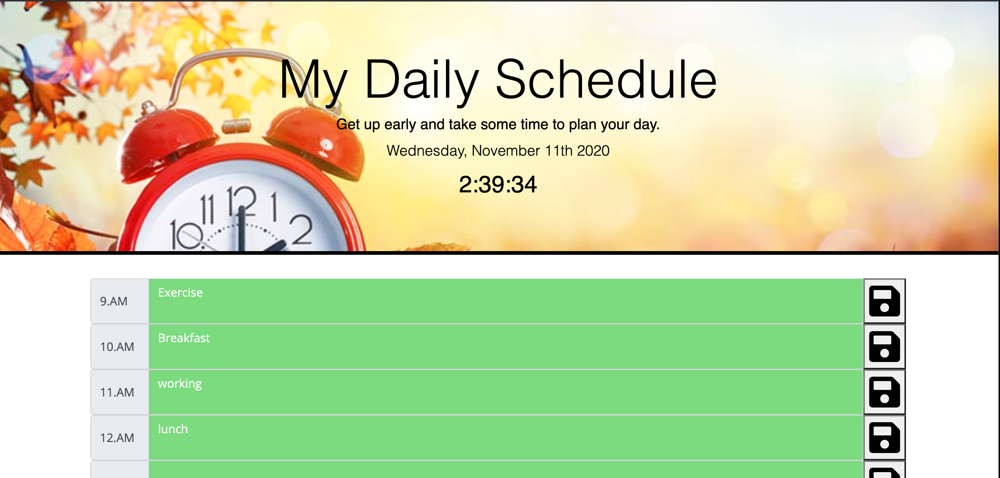
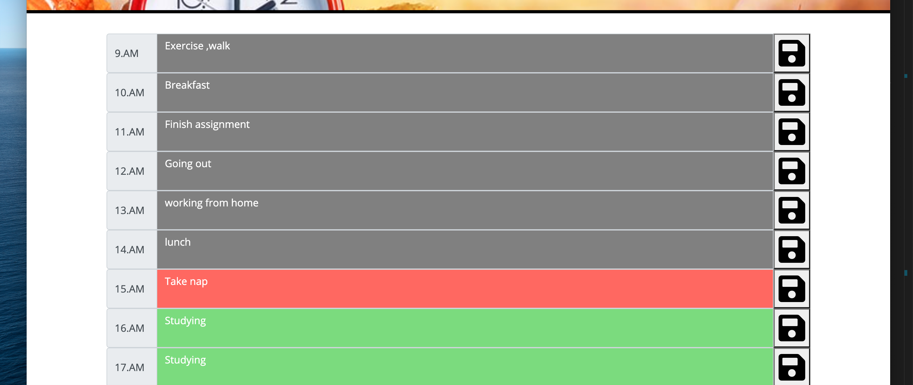

# Daily Planner

## Description

This project provides users with a daily planner where they can add their own events to an hourly log for the business hours of 9am-5pm. The planner results in effective time management and greater productivity as users' can easily plan their day ahead.

## Table of Contents 

* [Installation](#Installation)
* [user Guide](#userGuide)
* [Technologies Used](#Technology)
* [Languages Used](#Languages)
* [Summary](#summary)
* [Final Result](#FinalResult)
* [ResourceReffered](#ResourceReffered)
* [Github_Links](#Github_Links)

## Installation
To install this code, download the zip file, or use GitHub's guidelines to clone the repository., Links are provided below in resources.

## User Guide
Enter your notes into the text area for the desired time block and click the save button to store it!
Grey boxes indicate past hours, red boxes equals the present hour, and green boxes are future hours.

## Technologies Used
1.Bootstrap-CSS Framework 
2.Moment.js 
3.Save icons from fontawesome

## Languages used
1.Javascript 
2.HTML 
3.CSS

## Summary

Using moment.js, set intervel,JavaScript logic, the updated clock is set on the image at the top. it also shows the current date and day. 
Using local storage, and JavaScript logic, the timeblocks are set for each bussiness hour, which tracks to-dos for each hour of the day. The current hr is set as red color, past hrs are grey, future hours are in green color.
The user can input text into each block and click on the save button , it will save  the  text  into their local storage. so whenever user will open day planner again, the data will be visible on timeblocks.
 I have Used a wide variety of JQuery methods for functionality within my code.
 I have used 'this' keyword in my program to reduce redundancy of the code. 

## Final Result
### ScreenShots
Current updated clock on the screen with current day and date.

Current hour:Red  Past hour:Grey Future hour:Green

## ResourceReffered

[For layout] https://getbootstrap.com/docs/4.1/getting-started/introduction/ 
[For getting time and day]  https://momentjs.com/docs/#/displaying/ 
[For other things https://www.w3schools.com/jsref/met_win_setinterval.asp  
[For concepts] https://stackoverflow.com/questions/3275164/javascript-quiz  

## Github_Links
[**URL of My Github Repository**](https://github.com/guptaria/Daily_Planner) 
[**URL of Deployed Application**](https://guptaria.github.io/Daily_Planner/.)

